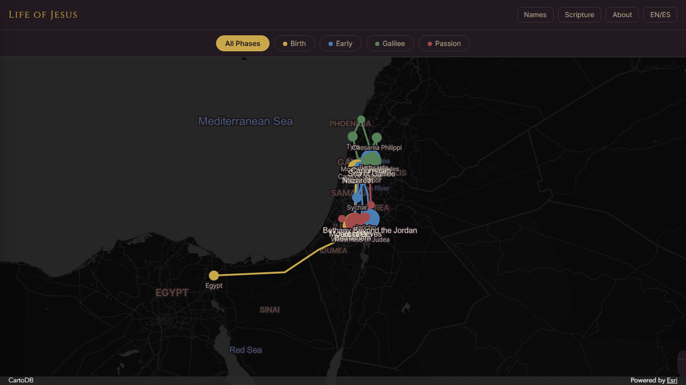
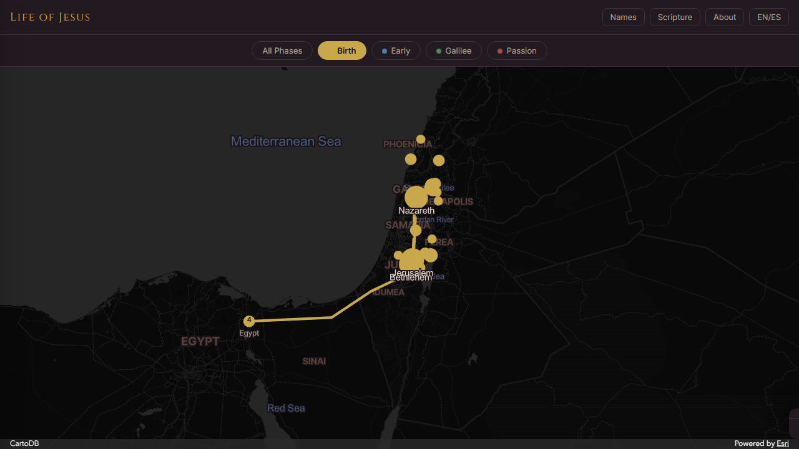
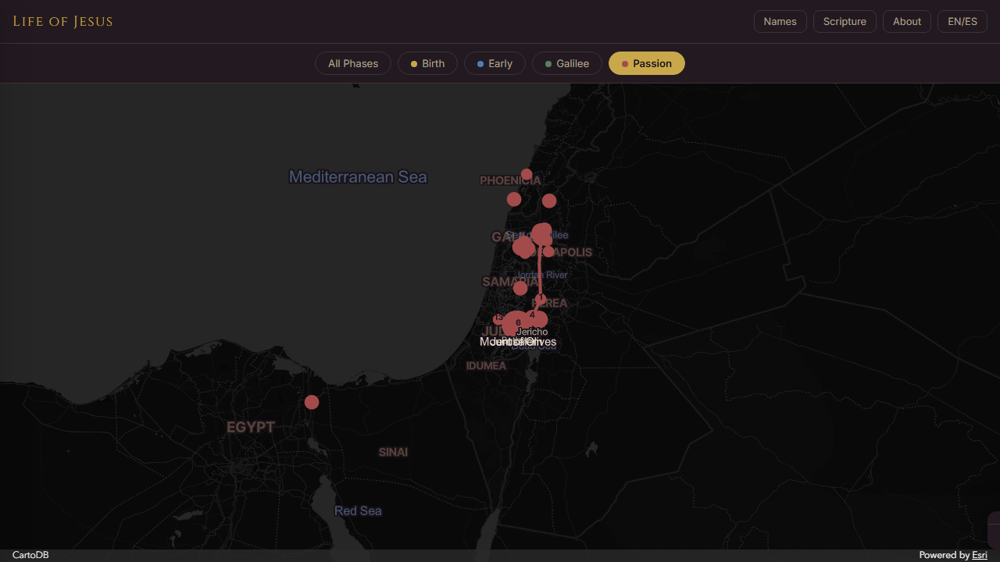

# The Life of Jesus / La Vida de Jesús

An interactive map of the Holy Land tracing the life and ministry of Jesus Christ as recorded in all four Gospels — Matthew, Mark, Luke, and John.

**[View the Live Map](https://garridolecca.github.io/life-of-jesus/)**



## About

This project brings the Gospel narrative to life on an interactive map. From the nativity in Bethlehem to the ascension on the Mount of Olives, every major event is placed on the geography where it happened, with Scripture references, direct Bible quotations, and detailed descriptions.

The map organizes Jesus's life into four phases, each with its own color-coded route and city markers:

| Phase | Period | Color | Key Events |
|---|---|---|---|
| **Birth & Childhood** | c. 6–4 BC | Gold | Nativity, Magi, Flight to Egypt, Boy Jesus at the Temple |
| **Early Ministry** | c. AD 27 | Blue | Baptism, Temptation, Wedding at Cana, Woman at the Well |
| **Galilean Ministry** | c. AD 27–29 | Green | Sermon on the Mount, Feeding the 5,000, Transfiguration |
| **Passion & Resurrection** | c. AD 29–30 | Crimson | Triumphal Entry, Last Supper, Crucifixion, Resurrection |



## Features

- **25+ biblical locations** plotted on an accurate map of ancient Israel, Judea, Galilee, Samaria, Phoenicia, and Egypt
- **45+ events** from all four Gospels with descriptions, Scripture references, and direct Bible quotations
- **Phase filtering** — view all events at once or focus on a single phase of Jesus's life
- **Scripture index** — searchable side panel organized by book and chapter (Matthew through Acts)
- **Bilingual support** — full English and Spanish (Español) interface, including city names, event descriptions, and Bible quotes (NIV / RVR1960)
- **Biblical / modern name toggle** — switch between ancient and contemporary place names
- **Interactive city markers** — click any location to open a detail panel with all events that occurred there
- **Color-coded routes** — outbound and return paths drawn for each life phase
- **Responsive design** — works on desktop, tablet, and mobile with touch-drag bottom sheet



## Tech Stack

- **[ArcGIS Maps SDK for JavaScript 5.0](https://developers.arcgis.com/javascript/)** — map rendering, geospatial graphics, markers, polylines, text symbols
- **[Calcite Design System](https://developers.arcgis.com/calcite-design-system/)** — UI shell and layout components
- **Vanilla JavaScript (ES Modules)** — zero framework dependencies, no build step
- **[CartoDB Positron](https://carto.com/basemaps/)** — dark basemap tiles (optional ArcGIS basemap with API key)
- **CSS3 Custom Properties** — full theme system with glass-morphism effects
- **Google Fonts** — Cinzel (display) + Inter (body)

## Project Structure

```
life-of-jesus/
├── index.html          # Main HTML with Calcite shell layout
├── css/
│   └── styles.css      # Theme, responsive design, animations
├── js/
│   ├── app.js          # Map initialization, UI logic, interactions
│   ├── data.js         # All biblical/geographic data (cities, events, routes)
│   └── i18n.js         # Bilingual EN/ES translations
└── screenshots/        # README images
```

## Running Locally

No build step required. Serve the files with any static HTTP server:

```bash
# Using Python
python -m http.server 8080

# Using Node.js
npx http-server -p 8080

# Then open http://localhost:8080
```

## Optional: ArcGIS API Key

The app works without an API key using CartoDB tiles. For the premium ArcGIS "Human Geography" basemap, add your key at the top of `js/app.js`:

```js
const ARCGIS_API_KEY = "YOUR_KEY_HERE";
```

Get a free key at [developers.arcgis.com](https://developers.arcgis.com/).

## Scripture Sources

- **English** — New International Version (NIV)
- **Spanish** — Reina-Valera 1960 (RVR1960)

## License

MIT

---

*"I am the way and the truth and the life. No one comes to the Father except through me."* — John 14:6
